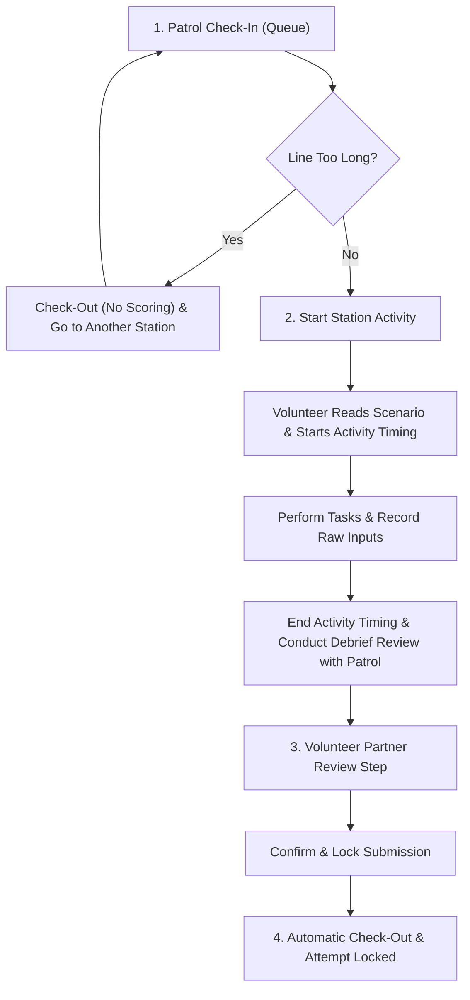

# NightRunner Station Lifecycle & Volunteer Scoring Workflow

This document details the station lifecycle, queue management, partner verification, scoring privacy rules, and automatic check-out flow for NightRunner.

---

## Patrol Station Lifecycle

---

## Detailed Step-by-Step Breakdown

### 1. Patrol Check-In & Queue Management
- When a patrol arrives at a station, volunteers check them in via QR code scan or manual selection on the Check In / Check Out screen.
- **Abandoning Line**: If the queue at a station is too long, the patrol can check out without scoring. Because no score was submitted, their station attempt remains open, allowing them to return and re-check in later during the event.

### 2. Station Activity & Debrief
- **Start Timing**: When it is the patrol's turn, the volunteer starts station activity timing (`startedAt`).
- **Read Scenario**: The volunteer reads the station scenario to the patrol.
- **Task Execution & Raw Record**: Volunteers enter raw task completions (checkboxes, counts, time, text responses, option choices).
- **Debrief Review**: Upon completion, the volunteer stops activity timing (`completedAt`) and conducts a debrief review with the patrol.
  > [!IMPORTANT]
  > **Scoring Privacy Rule**: Volunteers highlight key qualitative feedback (e.g. key takeaways, safety points, commendable actions) during the debrief. **Points, weights, and total scores are strictly hidden from patrols and station volunteers** to keep patrols focused on doing their best rather than comparing scores.

### 3. Volunteer Partner Review
- Before submitting the score to the database, volunteers enter a **Partner Review Step** on the scoring form.
- Both station volunteers review the entered task completions, participant count (if applicable), activity timing, and judge notes together to ensure mutual agreement.
- The review modal displays task choices and completion states cleanly **without revealing point weights or calculated score values**.

### 4. Automatic Check-Out & Attempt Locking
- Clicking **"Confirm & Lock Submission"** submits the score to the backend.
- The backend automatically:
  1. Records the score entries.
  2. Sets `checkedOutAt = stationCompletedAt` (or current timestamp) on the active visit record.
  3. Sets visit `status = "completed"`.
- This automatically checks out the patrol upon completion, eliminating manual duplicate check-out steps while locking the station attempt.

---

## Role & Visibility Matrix

| User Role | Can View Raw Task Completion | Can View Judge Notes | Can View Points & Weights | Can View Event Rankings |
|-----------|------------------------------|----------------------|---------------------------|-------------------------|
| Patrol / Youth | ❌ (Debrief feedback only) | ❌ | ❌ | ❌ |
| Station Volunteer | ✅ | ✅ | ❌ | ❌ |
| Station Leader | ✅ | ✅ | ❌ | ❌ |
| Scoring Team / Event Admin | ✅ | ✅ | ✅ | ✅ |
| System Admin | ✅ | ✅ | ✅ | ✅ |
