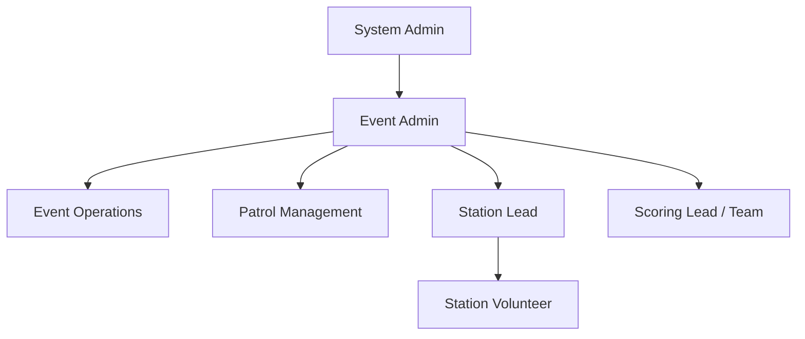
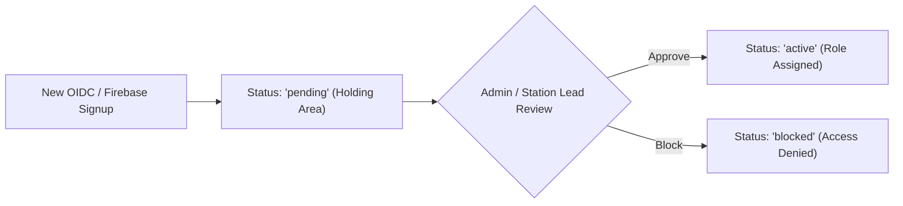

# NightRunner Roles, Permissions & User Assignments

This document details the user roles, access control hierarchy, event visibility, assignment permissions, and feature capabilities in NightRunner.

---

## Access Control & Role Hierarchy



---

## Role Definitions & Scope

### 1. System Admin
- **Scope**: Global system-wide access.
- **Event Visibility**: Can view and access **all events** (including newly created events before any Event Admin is assigned).
- **Permissions**:
  - Full system configuration & user management (approve pending users, assign System Admin status, block users).
  - Assign Event Admins, Scoring Leads, Station Leads, and Volunteers to any event.
  - Full access to all stations, scoring data, override controls, and report generation.

### 2. Event Admin
- **Scope**: Event-specific access.
- **Event Visibility**: Can view and access only events where they are assigned as Event Admin (or System Admin).
- **Permissions**:
  - Manage event details, patrols, stations, and configurations.
  - Assign additional users to event roles (Scoring Lead, Station Lead, Volunteer) and station assignments.
  - Full station activity timing & scoring capabilities across all stations in the event.
  - Access to Event Score Finalizer, calculation adjustments, and all score report generation.

### 3. Event Operations (`event-ops`)
- **Scope**: Event-specific gate check-in & arrivals logistics.
- **Event Visibility**: Can view and access assigned events.
- **Permissions**:
  - Access to the **Arrivals Dashboard** (`/arrivals/dashboard`) and **Gate Check-In** screen (`/arrivals`).
  - Record participant arrivals by troop or individual.

### 4. Patrol Management (`patrol-management`)
- **Scope**: Event-specific patrol registration and roster management.
- **Event Visibility**: Can view and access assigned events.
- **Permissions**:
  - Access to the **Patrol Manager** page (`/admin/patrols`).
  - Scan patrol QR codes to quickly view/edit patrol information.
  - Create, update, and manage patrol registrations and roster member assignments.

### 5. Scoring Lead / Scoring Team
- **Scope**: Event-specific scoring operations.
- **Event Visibility**: Can view and access assigned events.
- **Permissions**:
  - Review scores across all stations for the event.
  - Perform manual paper-entry score submissions for any station.
  - Access Event Score Finalizer page to calculate, adjust, and finalize event scores.
  - Generate all scoring reports (Scoring Lead, Event Admin, System Admin).

### 6. Station Lead
- **Scope**: Event-specific & station-specific operations.
- **Event Visibility**: Can view and access assigned events.
- **Permissions**:
  - Assign and manage volunteers specifically for their assigned station(s).
  - Perform station check-in/check-out and activity scoring at their assigned station.
  - Override or reopen completed station attempts for their station (beyond the 5-minute volunteer self-reset window).

### 7. Station Volunteer / Scorer
- **Scope**: Station-level scoring tasks.
- **Event Visibility**: Can view and access assigned events.
- **Permissions**:
  - Check in / check out patrols at assigned stations.
  - Record activity timing, task completions, and judge notes on the scoring page.
  - Self-reopen/reset station attempts within a 5-minute window following completion (requires Station Lead authorization beyond 5 minutes).
  - **Scoring Privacy Restriction**: Cannot view point weights, score values, or final event rankings.

---

## Detailed Permissions & Capabilities Matrix

| Feature / Action | System Admin | Event Admin | Event Ops | Patrol Mgmt | Scoring Lead / Team | Station Lead | Station Volunteer |
|------------------|--------------|-------------|-----------|-------------|---------------------|--------------|-------------------|
| **View All System Events** | ✅ | ❌ (Assigned only) | ❌ (Assigned only) | ❌ (Assigned only) | ❌ (Assigned only) | ❌ (Assigned only) | ❌ (Assigned only) |
| **Arrivals & Gate Check-In** | ✅ | ✅ | ✅ | ❌ | ❌ | ❌ | ❌ |
| **Patrol Manager & QR Scanning** | ✅ | ✅ | ❌ | ✅ | ❌ | ❌ | ❌ |
| **Assign Event Admins** | ✅ | ❌ | ❌ | ❌ | ❌ | ❌ | ❌ |
| **Assign Station Leads & Staff** | ✅ | ✅ | ❌ | ❌ | ❌ | ✅ (Their station) | ❌ |
| **View Point Weights & Point Totals** | ✅ | ✅ | ❌ | ❌ | ✅ | ❌ | ❌ |
| **Manual Score Entry (Any Station)** | ✅ | ✅ | ❌ | ❌ | ✅ | ❌ (Their station) | ❌ (Their station) |
| **Reopen Completed Attempt (<= 5 mins)** | ✅ | ✅ | ❌ | ❌ | ✅ | ✅ | ✅ |
| **Reopen Completed Attempt (> 5 mins)** | ✅ | ✅ | ❌ | ❌ | ✅ | ✅ (Their station) | ❌ |
| **Access Score Finalizer Page** | ✅ | ✅ | ❌ | ❌ | ✅ | ❌ | ❌ |
| **Generate Scoring Reports** | ✅ | ✅ | ❌ | ❌ | ✅ (Scoring Lead) | ❌ | ❌ |

---

## User Onboarding & Holding Area Flow



- When a new user logs in for the first time via OIDC / Firebase Auth, they are automatically provisioned with `status = "pending"` in the user holding area.
- Pending users cannot access event data until an Admin or Station Lead approves them and assigns them an event/station role.

---

## Local Development Identity Providers

NightRunner supports two local OIDC development modes:

### 1. Default Lightweight Mock OIDC (`oidc-server-mock`)
Fast, stateless OIDC server for quick local testing and automated CI.
```bash
docker compose up -d
```

### 2. Authentik Identity Provider Overlay
Full interactive OIDC provider with UI login, user management, and automated blueprint bootstrapping (`authentik/blueprints/nightrunner-dev.yaml`).
```bash
./scripts/start-dev-authentik.sh
```
Or directly via docker compose:
```bash
docker compose -f docker-compose.yaml -f docker-compose.authentik.yaml up -d --build
```
- **OIDC Authority**: `http://localhost:9000/application/o/nightrunner/`
- **Default Users & Password**: `adminuser`, `organizeruser`, `scoreruser`, `leaderuser` (Password: `password`)
- **Frontend Dev Mode**: Run `yarn --cwd nightrunner_frontend dev:authentik` to run Vite configured with Authentik OIDC authority (`.env.authentik`).

